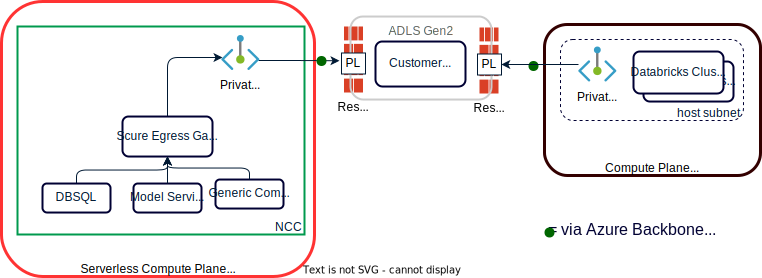

# Initial Steps
- Follow azure-databricks-uc-metastore for Metastore creation.
- Follow azure-databricks-workspace-vnet for creating workspace with NET injection.
- Follow azure-databricks-workspace-ncc for enabling NCC in the existing workspace.
- Follow azure-databricks-uc-metastore-catalog for adding catalog with data storage and bind to workspace

# to block public access to the following azure services
- block public access to storage account and allow only access from the specific virtual network subnets and NCC.

### Network Architecture
