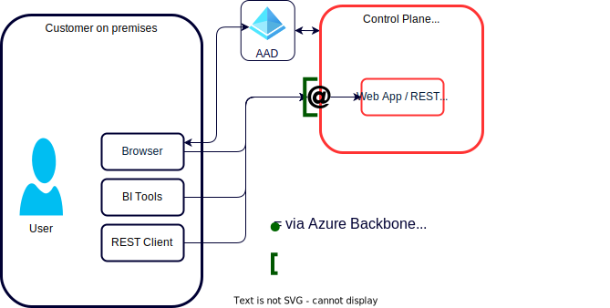

# Network Access
## Deployment Option - Default
### User to Control Plane
- access is restricted with IP Access Lists
### VNet to Control Plane
- the VNet is managed by Databricks 
- simple to deploy but no customizations
### VNet to Storage
- Default  :  Public Endpoints --> storage accounts are accessible from the Internet

### Communication in a Databricks Workspace
- The default setup uses Databricks managed VNet, however VNet injection with SCC is recommended
- Compute Plane and Control Plane always communicate over Azure Backbone
- Control Plane to DBFS is going over Azure Backbone since both are first party Azure services
- Nevertheless, communication between Control and Compute Plane uses Public IPs on both planes
- Users access Databricks over the Public Internet (but access is restricted with IP Access Lists)
- Do NOT use DBFS as a storage layer (e.g. no access control) but rather use storage accounts with Unity Catalog access control for all customer tables, volumes, …

### Network Architecture

